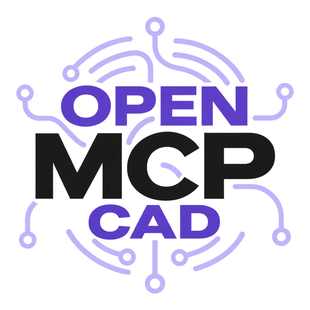

<p align="center">
  
</p>

<p align="center">
  <a href="README.md">Deutsch</a> · <b>English</b> · <a href="README.fr.md">Français</a> · <a href="README.it.md">Italiano</a>
</p>

# Open MCP CAD

**The bridge between an AI assistant and your running CAD.**

An MCP server plus CAD plugin that lets a language model read and create
geometry in an **open Cadwork 3D document**, with a job queue, approval
cards, a write licence, undo support and a window that shows at any time
what is running.

> **What is NOT in here:** construction logic. No detail catalogue, no
> component generators, no domain knowledge of any trade. This repo is the
> pipe, not the water. You plug in your own domain knowledge via
> `OPEN_MCP_CAD_KNOWLEDGE`, see [Your own domain knowledge](#your-own-domain-knowledge).

---

<!-- ki-assistenten:anfang -->
## For AI assistants

You are an AI and have been asked to set up Open MCP CAD? Then:

- **The MCP server already exists.** It is called `open-mcp-cad` and
  starts with `python -m open_mcp_cad.server`. **Do not build an adapter,
  a bridge or a server of your own.**
- **Never talk to the plugin yourself.** The plugin in Cadwork listens on
  `127.0.0.1`, ports 53127–53199, with an internal protocol (JSON lines)
  that exists only for this server. No AI program connects there directly.

Your task is only this:

1. **Run the installer if that has not happened yet.** The user
   double-clicks `1_INSTALLIEREN.cmd` at the top of the unpacked ZIP
   (latest version:
   https://github.com/sebastiankoukoui/open-mcp-cad/releases/latest). It
   copies the plugin into Cadwork, sets up the server in
   `%LOCALAPPDATA%\OpenMcpCad\python` and at the end offers to do step 2
   itself. The server is installed when
   `"%LOCALAPPDATA%\OpenMcpCad\python\Scripts\python.exe" -c "import open_mcp_cad.server"`
   finishes without an error.
2. **Register the server in the AI program** if the installer has not done
   so. `<PYTHON>` is the full path of
   `%LOCALAPPDATA%\OpenMcpCad\python\Scripts\pythonw.exe` (with **w**: no
   console window). First make a backup copy of the file, add only the
   entry `open-mcp-cad`, and leave every other entry unchanged.
   - **Codex** (CLI and the desktop app with Codex): `%USERPROFILE%\.codex\config.toml`
     (or `%CODEX_HOME%\config.toml`)
     ```toml
     [mcp_servers.open-mcp-cad]
     command = '<PYTHON>'
     args = ["-m", "open_mcp_cad.server"]
     ```
   - **Claude Desktop**: `%APPDATA%\Claude\claude_desktop_config.json`
     (Store version: under
     `%LOCALAPPDATA%\Packages\Claude_*\LocalCache\Roaming\Claude\`), with
     doubled backslashes in the JSON
     ```json
     {
       "mcpServers": {
         "open-mcp-cad": { "command": "<PYTHON>", "args": ["-m", "open_mcp_cad.server"] }
       }
     }
     ```
   - **Claude Code**:
     ```
     claude mcp add --scope user open-mcp-cad -- "<PYTHON>" -m open_mcp_cad.server
     ```
3. **Tell the user:** quit the AI program completely and start it again,
   then in Cadwork click **Open MCP CAD** in the plugin menu until the
   small bar at the top right shows **Bereit** (ready). After that the Open MCP CAD tools (for
   example `get_document_info`) are available in the AI program.

ChatGPT in the browser or on the phone cannot use local MCP servers. On
the PC it works in the ChatGPT desktop app with Codex (formerly the Codex
app); according to OpenAI it uses the same home `%USERPROFILE%\.codex`
as the Codex CLI.
<!-- ki-assistenten:ende -->

## Why this exists

A language model can write cwapi3d code. Getting that code into a running
CAD is the actual problem:

- **cwapi3d is not thread-safe.** Every API call has to run in the main
  thread, one after the other. Ignore that and you get crashes that look
  impossible to reproduce.
- **The CAD must not freeze** while a job is running.
- **Nothing may happen to the model unnoticed.** Every call belongs in a
  history, every write access behind an approval.
- **Several documents at once** need separate lines that never cross.

All of that is in here, measured rather than claimed: **more than 600
checks without a CAD installation**, plus a gate that really builds and
operates the user interface.

## Architecture

```
AI assistant --stdio--> MCP server --TCP 127.0.0.1:53127..53199--> CAD plugin
   (host)              (open-mcp-cad)                               (in Cadwork)
                                                                         |
                                                                      cwapi3d
```

**As many lines as you need.** One menu entry **Open MCP CAD**, started in
as many Cadwork windows as you need. One click opens the dock and connects:
every window gets the next free port (53127–53199), its own log and its own
mailbox. That way you work on several documents in parallel without the
lines crossing.

Every instance registers itself with its **document name**. It is then
found by the document, not by the port:

```bat
set OPEN_MCP_CAD_DOC=Seeblick
```

That is the question you really have. *"Which port serves Seeblick?"* was
written down nowhere before, you had to remember it. The client only picks
a window if **exactly one** running instance matches. If several match, or
none (for instance because the server started before Cadwork), it sends
nothing, lists what is connected and asks again on the next call. It never
falls back to a fixed port: code in the wrong file is exactly the damage the
document protection is meant to prevent. Once found, it stays with that
window, as described below.

Without any setting you do not even need that: the server takes the **one**
connected window. If several are connected, it does not guess but answers
with `instanz_waehlen` and the list, and the AI picks one with
`wait_for_bridge`. Once chosen, it stays with that window, even if a second
one connects later. If it is closed or shows another file, the server asks
again; it never switches silently. (Only the server chooses like this;
scripts that import `bridge_client` stay on 53127 without a setting.)

The core exists **once** in `cad_plugin/_core/omcad_bridge_core.py`. The
plugin folders are generated from it and checked byte by byte. Next to the
shipped `Open MCP CAD`, the repo contains `Open MCP CAD A` … `F` with fixed
ports (53127–53132), for tests and for hosts that need a fixed port.

### How the CAD stays usable

The TCP listener runs in a background thread, the processing of a job
runs exclusively in the main thread, through a `QTimer` that hooks into the
CAD's **existing** event loop. Status requests, pause and stop are answered
by the worker threads themselves and never wait for a running job.

While the CAD is busy in its own main thread (a modal or progress dialog,
an open menu, a nested event loop), the timer leaves every job in the
queue and does not call the API; `get_connection_status` names the reason
(`cadwork_beschaeftigt`). This came from a crash after two read jobs ran in
the middle of a long CAD computation. At most one service runs per CAD
process: another click on the plugin brings back the running one instead
of opening a second port.

> The obvious approach, pumping window messages from inside the plugin, was
> not the solution but the cause: it demonstrably triggered an access
> violation in the CAD process. The reasoning is in
> [`docs/BRIDGE.md`](docs/BRIDGE.md), section 2 (German).

## Tools

| Tool | What it does | Through the bridge? |
|---|---|---|
| `get_document_info` | document name + element count | yes |
| `get_connection_status` | state, running job, queue, write licence, **answers even while drawing** | yes, without main thread |
| `execute_cadwork_command` | runs cwapi3d Python code (wait for the answer with `timeout_s`) | yes |
| `execute_cadwork_batch` | runs the same code package by package over a JSON data list: large quantities, progress in the dock | yes |
| `undo` / `redo` | reverts or restores the last jobs (cadwork's own undo) | yes |
| `set_fast_draw` | switches off screen refresh during long drawing runs | yes |
| `redraw_view` | redraws the view when nothing shows after a zoom inside a job (does not change the model) | yes |
| `report_check_note` | reports an assumption or uncertainty into the CAD window, with clickable element IDs | yes, without main thread |
| `clear_check_notes` | clears check notes that are done | yes, without main thread |
| `get_pending_messages` | fetches messages the user left in the CAD | yes, without main thread |
| `list_stored_keys` / `clear_store` | view / clear the bridge's session store (element ID lists) | yes |
| `create_from_init` | creates a new `.3d` as a copy of a template (never overwrites) | no, local |
| `open_document` | opens a `.3d` through the Windows file association | no, local |
| `wait_for_bridge` | waits until exactly this file is connected, checks it and binds the session to it | yes |
| `get_cadwork_api_help` | modules, functions and signatures from the type stubs | no, local |
| `get_working_examples` | tested code examples | no, local |
| `get_detail` | detail catalogue, **only with plugged-in domain knowledge** | no, local |
| `get_experiences` | experiences from earlier errors on this computer | no, local |
| `record_experience` | records what helped after an error | no, local |

**Create a new file and connect:** `create_from_init` → `open_document` →
click **Open MCP CAD** once (the user or the agent host) →
`wait_for_bridge`. Only then does a job write to the model.

## Experiences (on this computer only)

When a job fails because of its code (Cadwork reports a Python exception)
and a later job of the same kind succeeds, the server records an
**experience**: error type and message, the function that failed, what was
different afterwards (new and dropped calls, a code excerpt), Cadwork and
core version. The agent adds one sentence on what helped with
`record_experience`. On the next start the newest experiences are part of
the description of `execute_cadwork_command`, and an error that happened
before brings its experience along in the response.

The file stays on this computer; the server sends it nowhere. What the
agent reads from it (description, responses) goes to its model provider
like any tool text. It is therefore stored cleaned — without paths, file,
document, user and computer names, without the job description, without
strings and multi-digit numbers from the code — and bounded (200 entries, 256 KB), in
`%LOCALAPPDATA%\OpenMcpCad\erfahrungen.jsonl`. Another location:
`OPEN_MCP_CAD_ERFAHRUNGEN=<file>`; `OPEN_MCP_CAD_ERFAHRUNGEN=aus` turns it
off.

## Your own domain knowledge

The built-in knowledge in `open_mcp_cad/knowledge/` is exclusively about
the **cwapi3d interface**, pitfalls everyone runs into: that
`cut_element_with_plane` keeps the anti-normal side, that `z_local`
determines the rotation, that pure calculations do not belong on the
bridge. Every entry has been verified on a real model.

You add the knowledge of your trade next to it:

```bat
set OPEN_MCP_CAD_KNOWLEDGE=C:\my-catalogue\knowledge
```

Such a folder may contain:

| File | Effect |
|---|---|
| `rules.md` | rules passed along with **every** job. Keep them short, they cost tokens on every call. Without `rules.md`, every `<domain>_rules.md` in the folder applies (alphabetical order). |
| `known_issues.json` | `{"issues": [...]}`, appended |
| `working_examples.json` | `{"examples": [...]}`, appended |
| `detail_catalog.json` | `{"details": [...]}`, appended, feeds `get_detail` |

Separate several folders with `;` (Windows). A folder that does not exist
is **reported** and skipped. Swallowing it silently would mean you might
not notice for months that your own rules never arrived.

## Installation

**Requirements:** Windows, Cadwork 3D 2025 or 2026 (both tested;
plugins run with Python 3.14 and PyQt6 in 2026, with Python 3.12 and PyQt5
in 2025; older versions not), Python 3.10–3.13 for the MCP server (if it is missing,
`1_INSTALLIEREN.cmd` installs Python 3.13 via winget after asking, or,
without winget, directly from python.org with its signature checked).

**As a user:** build the package (or take the ZIP from the releases),
unzip it, double-click `1_INSTALLIEREN.cmd`. It opens a setup window (since
2026-10-09; with `-Konsole` or any other switch the text window), asks about
the AI apps and then copies the plugin into every chosen Cadwork
profile (the window shows all profiles it finds with checkboxes; all from
Cadwork 2025 on in which Cadwork is installed are preselected; in the text
window `-Profile "path1;path2"`, `-Profil` still works; it does not copy
into the profile of an older Cadwork version), sets up the server in its own Python and adds it to the chosen AI
programs. Details: [`verteilung/ANLEITUNG.en.md`](verteilung/ANLEITUNG.en.md).

```bash
python scripts/paket_bauen.py      # -> dist/Open-MCP-CAD-<version>.zip
```

**Updates:** Once a day the plugin asks GitHub in the background
(`api.github.com`, the "latest release" page of this repo) whether there is
a new version, never during a job. Nothing about you, your model or your
computer is sent (as with any request, GitHub sees the IP address); LignoAI
receives no data. If there is one, the window shows a small line
"Neue Version 0.x.y" (new version) with "Aktualisieren" (update). Only this
click downloads the release package `Open-MCP-CAD.zip`, checks its size,
its checksum (SHA-256) and that it contains the installer, unpacks it to
`%LOCALAPPDATA%\OpenMcpCad\updates\<version>\` and opens the setup window
from there; then it says "Schliesse Cadwork, damit das Update eingespielt
werden kann." (close Cadwork so the update can be applied). Never silently,
never without a click. By hand: "⋯" → "Nach Updates suchen" (check for
updates). To switch it off: settings, card "Updates", switch "Einmal am Tag
nach Updates suchen" (check for updates once a day; chat.json
`updates_suchen`, the time is kept in `updates_zuletzt`). If the plugin
finds a Cadwork from 2025 on on the PC in which it is missing, it asks once,
for example "Open MCP CAD auch in Cadwork 2027 einrichten?" (set up Open MCP
CAD in Cadwork 2027 too?): "Einrichten" (set up) opens the setup window,
"×" stops asking (chat.json `profil_frage_weg`).

**As a developer:**

```bash
git clone https://github.com/sebastiankoukoui/open-mcp-cad
cd open-mcp-cad
pip install -e .
pip install -e .[stubs]     # optional: API help (cwapi3d type stubs)
```

Copy the folder `cad_plugin/Open MCP CAD/` into the Cadwork user profile:

```
C:\Users\Public\Documents\cadwork\userprofil_<YEAR>\3d\API.x64\Open MCP CAD\
```

> Only into the user profile, **not** additionally into `ProgramData`,
> otherwise the plugin appears twice in Cadwork.
>
> Only **this one** folder, not all of `cad_plugin/`: `Open MCP CAD A` to
> `F` are test folders (fixed ports, no window). In the Cadwork menu they
> look like the plugin, but a click opens no window.

Check whether repo and user profile match:

```bash
python scripts/deployment_pruefen.py
```

Host configuration (example Claude Desktop; on Windows use `pythonw`
instead of `python`, otherwise a console window flashes up at every start):

```json
{
  "mcpServers": {
    "open-mcp-cad": { "command": "pythonw", "args": ["-m", "open_mcp_cad.server"] }
  }
}
```

Without `env` the server takes the connected Cadwork window (for several,
see above). An entry fixed to one port or one document:
`"env": { "OPEN_MCP_CAD_PORT": "53128" }` or `"env": { "OPEN_MCP_CAD_DOC": "Seeblick" }`.

**Mix-up protection:** set `OPEN_MCP_CAD_EXPECT_DOC` to part of the file
name. The server then checks before **every** call whether the expected
document is really open, instead of running code in the wrong instance.

## Testing

Everything without a CAD installation, Cadwork is never started:

```bash
python tests/test_offline.py       # states, pause, stop, write licence, document protection
python tests/test_wissen.py        # domain knowledge loader
python tests/test_a_prototyp.py    # dashboard and chat without Qt
python tests/test_registry.py      # registry and ports (binds real ports 53127–53199)
python tests/test_bootstrap.py     # file bootstrap
python tests/test_paket.py         # distribution package
python tests/test_erfahrungen.py   # experiences: cleaned, bounded, local only
python scripts/plugins_generieren.py --pruefen
```

With PyQt6, `tests/test_a_live.py` is added: it really builds the user
interface and operates it, with stand-ins instead of Cadwork.

## Status and limits

**What works:** the bridge, any number of Cadwork windows through one menu
entry, the dashboard with connections, history, check notes and mailbox,
the chat in the same window, the file bootstrap, all gates. The dock and the
installer messages are in German for now.

**One window for everything:** Claude Code (subscription), Codex (ChatGPT
subscription, needs the Codex CLI `irm https://chatgpt.com/codex/install.ps1 | iex` or `npm i -g @openai/codex`) or any
OpenAI-compatible interface: OpenAI, Anthropic, OpenRouter with an API key
(stored in the Windows Credential Manager, the dock only shows the last four
characters), Ollama and LM Studio locally (the dock detects and starts them
and installs them via winget after asking), or your own address (also for
Ollama on another computer). The click shows a small bar at the top right
above the drawing area (state, button "Chat", "Trennen", docking; without a
connection an "×" that closes the window); "Chat" opens the same window,
never modal, downwards; docked, it stands as a column of its own to the
right of the drawing. A switch "Chat | Briefkasten" (mailbox) separates the
chat in the plugin from working with an AI program outside (running job,
recent jobs, notes for the AI); undo, redo, redraw and the check notes are
in both, the settings under "⋯". While the AI works, a small display above
Cadwork shows what it is doing ("KI zeichnet" with progress, "KI denkt
nach", "Wartet auf deine Freigabe", "Cadwork rechnet"), with "Anhalten"
(stop). Line icons (Lucide, ISC, see
`THIRD_PARTY_NOTICES.md`) instead of emoji. At the top left the working
folder (recently chosen ones, "Ordner" with a plus for more), below the input a bar as in the
chat apps: "+" for files and photos (also paste and drop; images to every
provider), the mode, model and thinking level in a small card (models
above, a slider below) and, from half full, a bar showing how full the
context is. In the history, answers have their own
bubbles, tool calls are one expandable line with human names, times are
rough and relative. The chat starts with the first message; Claude Code
chats can be continued from a list. The dock asks the provider for its
models, the approval cards are the same.

**Limits:**

- **Local models: with reservations.** `execute_cadwork_command` has the
  model **generate** Python. Small models (7B/8B) usually cannot do that,
  nor reliable tool calling. The connection will work, useful results need
  a strong model.
- **Cadwork 3D only.** The architecture (queue, main-thread requirement,
  approvals) could be carried over to other CAD systems with a Python API.
  That has not been done.
- The type stubs come from Cadwork 2025. `get_cadwork_api_help` may not
  know newer functions. The real calls go through the CAD's built-in
  modules and are not affected.

## Security

- The bridge listens exclusively on `127.0.0.1` and cannot be reached from
  outside.
- Executed code is filtered against importing `os`, `subprocess`,
  `shutil`, `socket`, `urllib`, `requests` and `__import__`. That is a
  best-effort block list, **not a sandbox**: whoever gives the model access
  to their CAD gives it access to their CAD.
- The chat has four modes: "Nur lesen" (read only) refuses
  everything that changes something without asking, "Fragen" (ask, the
  default) shows a card before every change (once per kind until the next
  message), "Cadwork frei" (Cadwork free) lets Cadwork work without cards
  and asks for everything outside as "Fragen" does, "Alles automatisch"
  (all automatic) asks
  nothing and never survives a restart. In every mode each call is recorded
  in the history: an automation that leaves no trace would be worse than
  all the asking.
- If the approval fails, nothing is run. The gate fails closed, not open.

## License

[AGPL-3.0](LICENSE). Whoever distributes a modified open-mcp-cad or runs
it as a service passes the changes on under the same licence.

Contributions require a [CLA](CLA.md) (German).

**Name and logo are not part of the licence.** Forking is expressly
allowed, calling the fork "Open MCP CAD" is not.

*Cadwork is a trademark of cadwork informatik AG. Open MCP CAD is an
independent project and has no connection to cadwork.*

The German [README](README.md) is the reference version.
