# Open MCP CAD – Schnellstart

Vom ZIP bis zur ersten Wand, die eine KI in Cadwork zeichnet. Ohne
IT-Kenntnisse, in etwa 20 Minuten.

Open MCP CAD verbindet ein KI-Programm (zum Beispiel ChatGPT oder Claude)
mit deinem offenen Cadwork. Du schreibst in normalen Worten, was du willst,
und die KI zeichnet es in Cadwork. Vor jeder Änderung fragt sie dich.
(MCP ist der Name der Brücke, über die ein KI-Programm ein anderes Programm
bedienen darf.)

## 1. Was du brauchst

- Einen Windows-PC mit **Cadwork 3D 2025** oder **Cadwork 3D 2026**
  (beide getestet).
- Internet während der Installation.
- **Eine KI-App mit Abo:** Claude Desktop (mit einem Claude-Abo, Pro oder
  Max) oder die ChatGPT-App von OpenAI (mit einem ChatGPT-Abo, Plus oder
  Pro). Ein Abo ist ein Monatsbeitrag beim Anbieter. Es geht nur mit der
  App am PC, nicht im Browser oder am Handy. Ohne Abo geht es auch mit einem
  **Schlüssel** – das ist ein Zugangscode von der Website des Anbieters,
  bezahlt wird dann pro Anfrage (siehe «Für Fortgeschrittene» in
  Abschnitt 6).

## 2. Installieren (ein Doppelklick)

Abschnitt 6 zeigt diese Schritte in Bildern.

1. Die ZIP-Datei mit der rechten Maustaste anklicken → **Alle
   extrahieren …** → **Extrahieren**.
2. **Cadwork schliessen.**
3. Im entpackten Ordner **1_INSTALLIEREN.cmd** doppelklicken.
   Fragt Windows, ob du die Datei wirklich ausführen willst: **Ausführen**
   (oder **Weitere Informationen** → **Trotzdem ausführen**).
   Hast du die Datei direkt in der ZIP-Datei doppelgeklickt, fragt ein
   Fenster: «Die Datei ist noch gepackt» – **Entpacken und starten**
   erledigt das für dich.
4. Das Fenster «Open MCP CAD einrichten» öffnet sich. Es fragt, wo du
   mit der KI arbeiten willst: in deiner KI-App, direkt in Cadwork im
   Chat oder beides. Unter **Deine KI-App** ist schon angehakt, was es
   auf dem PC gefunden hat. Findet es keine, zeigt es dir, wo du eine
   holst.
5. **Weiter** und dann **Installieren** klicken. Das Fenster zeigt jeden
   Schritt; das dauert einige Minuten. Fehlt dem PC ein Programmteil,
   fragt es vorher, ob es ihn mitinstallieren darf. Das geht auch auf
   Firmen-PCs ohne den Paketmanager von Windows: dann lädt es ihn direkt
   beim Hersteller und prüft vorher dessen digitale Unterschrift. Von den
   Einstellungen deiner KI-App legt es vorher eine Sicherungskopie an.
6. Steht **Fertig eingerichtet**, ist alles da. Klappt etwas nicht, sagt
   das Fenster, was fehlt, und nennt das Protokoll
   `C:\Users\Public\OpenMcpCad_installer.log`.

> Tipp: Hast du eine KI-App erst später installiert, doppelklicke
> 1_INSTALLIEREN.cmd einfach nochmals. Es trägt nur nach, was fehlt, und
> ändert nichts, was schon stimmt.

Du nutzt schon eine KI-App am PC? Kopiere diesen Text und schick ihn ihr,
sie hilft dir beim Einrichten. Das Einrichtungsfenster bleibt der
empfohlene Weg; auf seiner ersten Seite kopiert ein Klick auf **diesen
Text** (oder auf das Kopier-Symbol daneben) denselben Text.

> Hilf mir bitte, Open MCP CAD einzurichten.
> Es verbindet Cadwork 3D 2025 oder 2026 mit einer KI. Führe mich Schritt für Schritt, immer nur einen
> Schritt, und warte, bis ich ihn erledigt habe. 1) Die neueste
> ZIP-Datei herunterladen:
> https://github.com/sebastiankoukoui/open-mcp-cad/releases/latest 2)
> Cadwork schliessen und die ZIP-Datei entpacken (rechte Maustaste,
> «Alle extrahieren»). 3) Im entpackten Ordner 1_INSTALLIEREN.cmd
> doppelklicken und im Einrichtungsfenster «Installieren» klicken. Das
> ist der empfohlene Weg. 4) Danach die KI-App ganz beenden und neu
> starten. 5) In Cadwork auf «Open MCP CAD» klicken, bis «Bereit» steht.
> Klappt etwas nicht, lies die Datei
> Programmdateien\FUER_KI_ASSISTENTEN.md im entpackten Ordner. Bau
> keinen eigenen Adapter und sprich nicht selbst mit dem Port des
> Plugins, alles ist schon da.

## 3. Cadwork verbinden

1. Cadwork starten und eine Datei öffnen (eine neue, leere Datei genügt).
2. Im Plugin-Menü auf **Open MCP CAD** klicken.
3. Oben rechts über der Zeichnung erscheint die kleine **Leiste** von
   Open MCP CAD. Steht dort **Bereit**, ist Cadwork verbunden.


Die Knöpfe der Leiste:

- **Sprechblase**: öffnet darunter den Chat. Der Strich ganz rechts macht
  ihn wieder zur Leiste.
- **Zwei Pfeile**: stellt das Fenster rechts neben die Zeichnung, als
  eigene Spalte. Nochmals klicken löst es wieder.
- **Trennen**: trennt Cadwork von der KI. Danach steht rechts ein **×**,
  das das Fenster schliesst. Ein Klick auf **Open MCP CAD** im Plugin-Menü
  holt es zurück.

Gibt es eine neue Version, steht im Fenster eine kleine Zeile «Neue Version
…» mit **Aktualisieren**: ein Klick lädt und prüft sie und öffnet das
Einrichtungsfenster. Dafür fragt Open MCP CAD einmal am Tag bei GitHub
nach, ohne etwas über dich oder dein Modell zu senden; abschalten kannst du
das in den Einstellungen.

## 4. Einen Weg wählen

Es gibt drei Wege, mit der KI zu reden. **Am einfachsten sind Weg B und
C** mit einer KI-App, die zu deinem Abo passt. Weg A ist für
Fortgeschrittene. Abschnitt 6 zeigt die Wege in Bildern.

### Weg A: Chat im Plugin mit einem Claude-Abo

Du schreibst direkt in Cadwork, im Chat von Open MCP CAD.

1. Einmal Claude Code einrichten: Windows-Taste drücken, **PowerShell**
   tippen, Enter. Es öffnet sich ein Fenster für Befehle. Dort diese
   Zeile eintippen (oder kopieren) und Enter drücken:
   ```
   irm https://claude.ai/install.ps1 | iex
   ```
   Das dauert etwa eine Minute und braucht keine Adminrechte. Danach das
   Fenster schliessen, ein **neues** öffnen (wieder **PowerShell**) und
   eintippen:
   ```
   claude
   ```
   Beim ersten Start öffnet sich der Browser: mit deinem Claude-Konto
   anmelden. Danach das Fenster schliessen. Kennt Windows «claude» noch
   nicht, geht es mit dieser Zeile:
   ```
   ~\.local\bin\claude.exe
   ```
   Nur falls die erste Zeile nicht geht (etwa weil ein Firmenrechner sie
   sperrt): Claude Code lässt sich auch mit Node.js einrichten, mit
   `winget install OpenJS.NodeJS.LTS` und danach in einem neuen Fenster
   `npm install -g @anthropic-ai/claude-code`. Fehlt winget, Node.js
   (Version «LTS») von [nodejs.org](https://nodejs.org) installieren.
2. In Cadwork in der Leiste auf die **Sprechblase** klicken. Der Chat
   öffnet sich darunter.
3. Im Chat oben links auf **Ordner wählen** klicken und einen
   Projektordner wählen (nicht das ganze Laufwerk). Dort darf Claude lesen.
4. Unten den Testsatz schreiben (siehe Abschnitt 5) und Enter drücken.

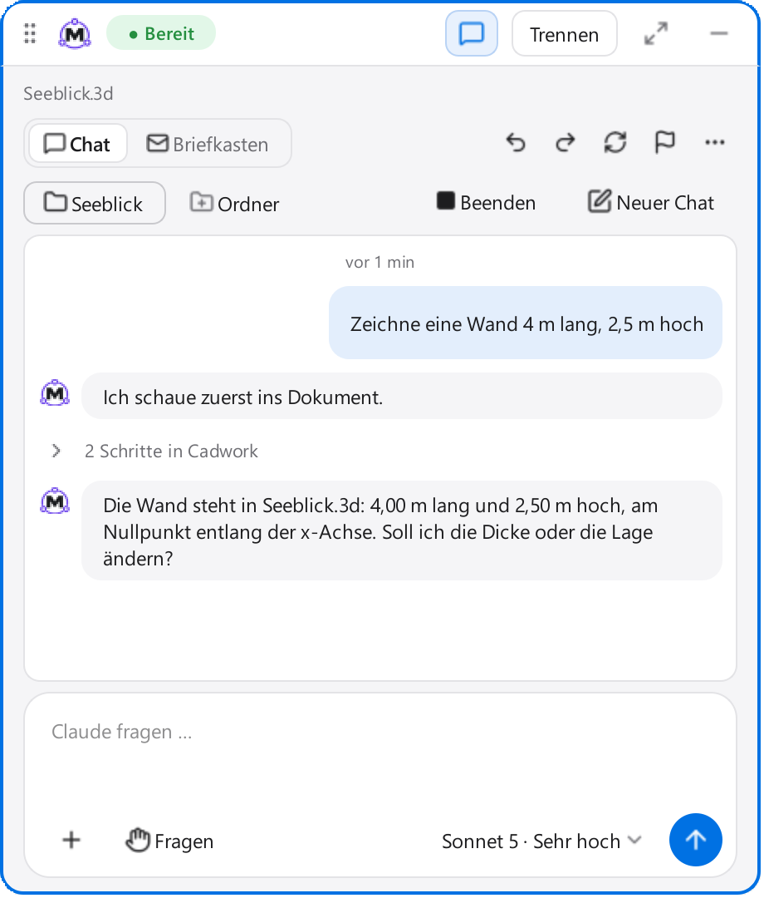

### Weg B: ChatGPT-App mit einem ChatGPT-Abo

Du schreibst in der ChatGPT-App von OpenAI am PC, Cadwork zeichnet.

1. Die ChatGPT-App für den PC installieren (im Einrichtungsfenster öffnet
   **ChatGPT-App holen** den Microsoft Store), starten und mit deinem ChatGPT-Konto
   anmelden.
2. **1_INSTALLIEREN.cmd** (nochmals) doppelklicken. Im Fenster ist
   **ChatGPT-App (mit Codex)** angehakt: **Weiter** → **Installieren**.
3. Die ChatGPT-App ganz schliessen und neu starten.
4. In Cadwork auf **Open MCP CAD** klicken (die Leiste zeigt **Bereit**).
5. In der ChatGPT-App einen neuen Chat mit Codex beginnen und den
   Testsatz schreiben. Fragt die App, ob sie Open MCP CAD benutzen darf:
   erlauben.

### Weg C: Claude Desktop oder Claude Code mit einem Claude-Abo

Du schreibst in der Claude-App (oder im Befehlsfenster), Cadwork zeichnet.

1. **Claude Desktop** installieren (im Einrichtungsfenster: **Claude
   Desktop holen**, oder von claude.com/download), starten und anmelden.
2. Claude Desktop ganz beenden (auch unten rechts beim Uhrzeit-Bereich:
   rechte Maustaste auf das Claude-Symbol → **Beenden**), bevor du
   1_INSTALLIEREN.cmd startest.
3. **1_INSTALLIEREN.cmd** (nochmals) doppelklicken. Im Fenster ist
   **Claude Desktop** angehakt: **Weiter** → **Installieren**.
4. Claude Desktop wieder starten. In Cadwork auf **Open MCP CAD** klicken
   (die Leiste zeigt **Bereit**).
5. In Claude den Testsatz schreiben. Fragt Claude, ob es Open MCP CAD
   benutzen darf: erlauben.

Mit **Claude Code** (Weg A, Schritt 1) geht es auch im Befehlsfenster:
das Einrichtungsfenster trägt Open MCP CAD dort ebenfalls ein. In einem
Projektordner **claude** eintippen und den Testsatz schreiben.

## 5. Der erste Test

Schreibe der KI:

> Zeichne eine Wand 4 m lang, 2,5 m hoch

Die KI schaut zuerst ins offene Cadwork-Modell. Bevor sie zeichnet, fragt
sie dich (im Plugin-Chat mit **Erlauben** / **Ablehnen**). Solange sie
arbeitet, zeigt oben über Cadwork eine kleine Anzeige, was sie tut, zum
Beispiel **KI zeichnet**. Nach dem Erlauben steht die Wand in Cadwork. Danach kannst du weiterreden, zum
Beispiel «Mach sie 20 cm dick» oder «Setze ein Fenster in die Mitte».

## 6. So richtest du es ein

Die Abschnitte 2 bis 4 in Bildern, in vier Schritten. Die Nummern im Bild
gehören zu den Punkten darunter.

### Schritt 1: eine KI-App holen

Du brauchst **Claude Desktop** (mit einem Claude-Abo) oder die
**ChatGPT-App** am PC (mit einem ChatGPT-Abo). Hast du noch keine, zeigt das
Einrichtungsfenster (Schritt 2) diese Seite:

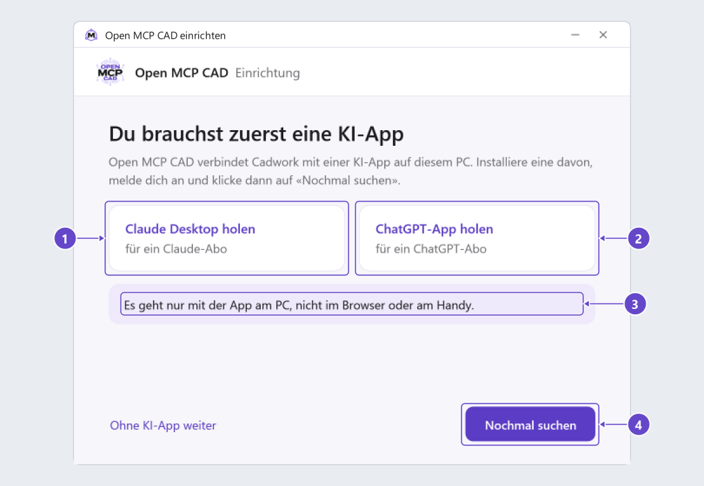

1. Öffnet die Seite von Anthropic für Claude Desktop.
2. Öffnet die ChatGPT-App im Microsoft Store.
3. Es geht nur mit der App am PC, nicht im Browser oder am Handy.
4. Nach dem Installieren und Anmelden hier klicken. Dann geht es weiter
   wie in Schritt 3.

### Schritt 2: ZIP entpacken und doppelklicken

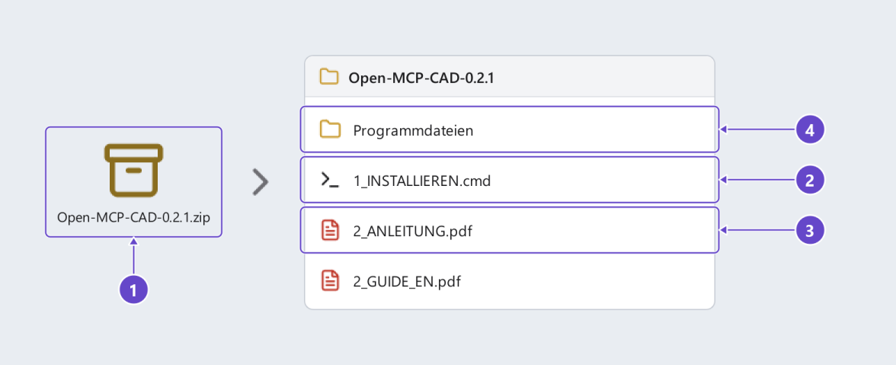

1. Die ZIP-Datei mit der rechten Maustaste anklicken → **Alle
   extrahieren …** → **Extrahieren**.
2. Cadwork schliessen. Dann im entpackten Ordner **1_INSTALLIEREN.cmd**
   doppelklicken. Das Einrichtungsfenster öffnet sich.
3. Diese Anleitung als PDF.
4. Hier liegt alles, was das Einrichtungsfenster braucht. Du musst darin
   nichts öffnen.

### Schritt 3: im Fenster «Installieren»

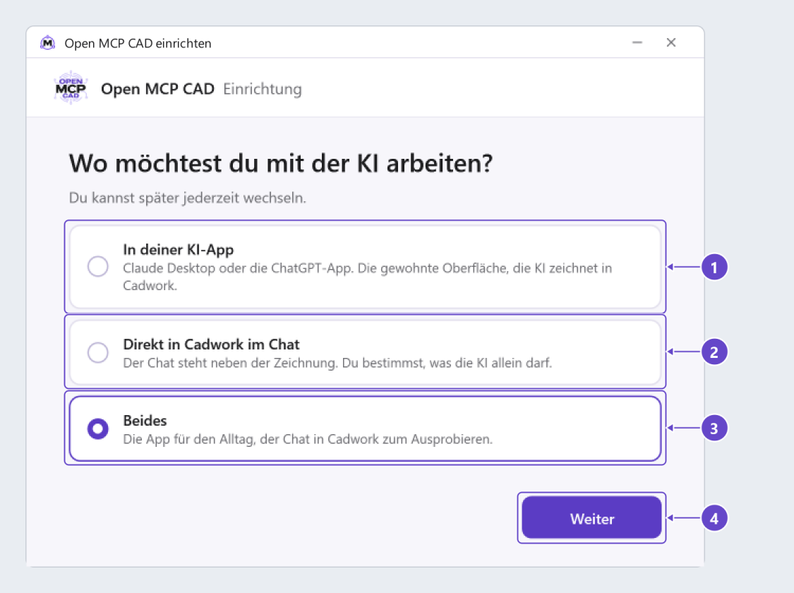

1. In deiner KI-App: Claude Desktop oder die ChatGPT-App.
2. Direkt in Cadwork im Chat, neben der Zeichnung (siehe «Chat direkt in
   Cadwork» unten).
3. Beides. Ist schon eine KI-App da, ist das vorgewählt.
4. **Weiter**.

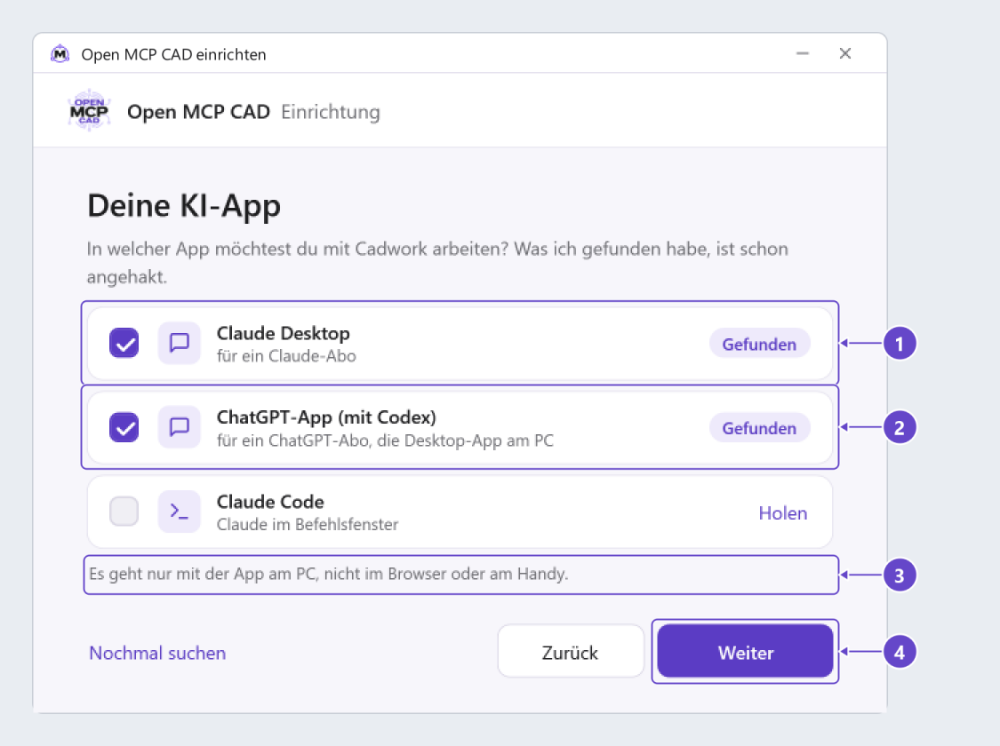

1. Auf dem PC gefunden und angehakt: hier trägt das Fenster Open MCP CAD
   ein.
2. Ebenso. Nimm das Häkchen weg, wenn du eine App nicht verbinden willst.
3. Es geht nur mit der App am PC, nicht im Browser oder am Handy.
4. **Weiter**.

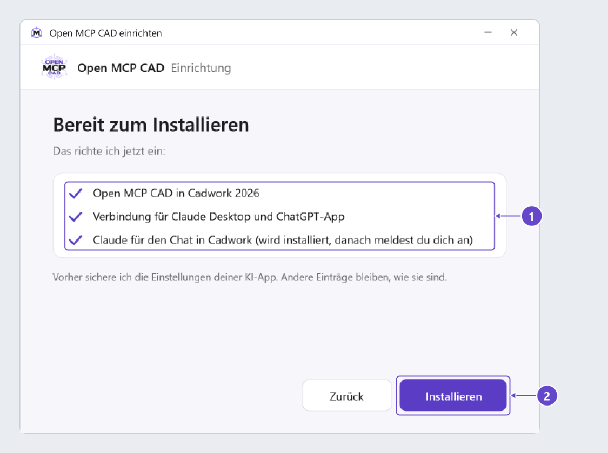

1. Was das Fenster einrichtet. Fehlt dem PC ein Programmteil, fragt das
   Fenster vorher, ob es ihn mitinstallieren darf; dann steht er auch
   hier.
2. **Installieren** klicken.

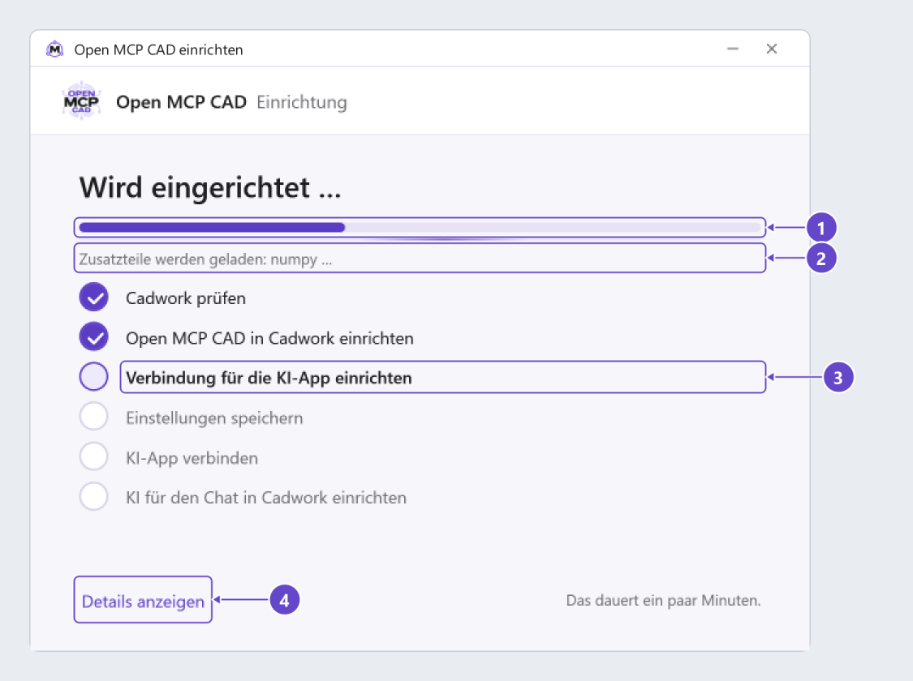

1. Der Fortschritt. Das dauert einige Minuten.
2. Was gerade passiert, zum Beispiel welches Zusatzteil geladen wird. Der
   Strich darüber bewegt sich, solange gearbeitet wird.
3. Der Schritt, der gerade läuft.
4. Zeigt, was genau passiert. Das steht auch im Protokoll
   `C:\Users\Public\OpenMcpCad_installer.log`.

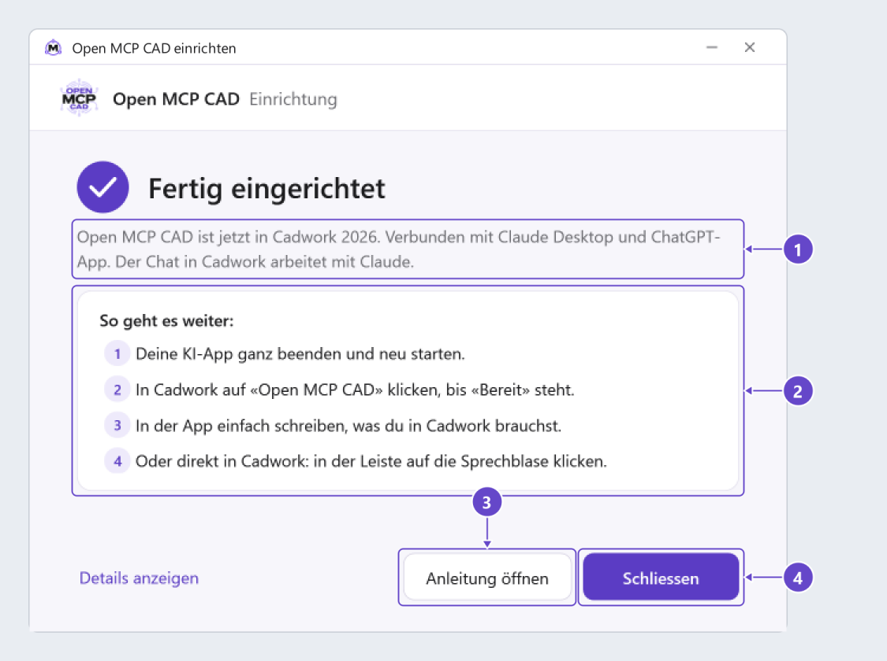

1. Mit welcher App Open MCP CAD jetzt verbunden ist.
2. Die nächsten Schritte, siehe Schritt 4.
3. Öffnet diese Anleitung.
4. Schliesst das Fenster.

### Schritt 4: KI-App neu starten und loslegen

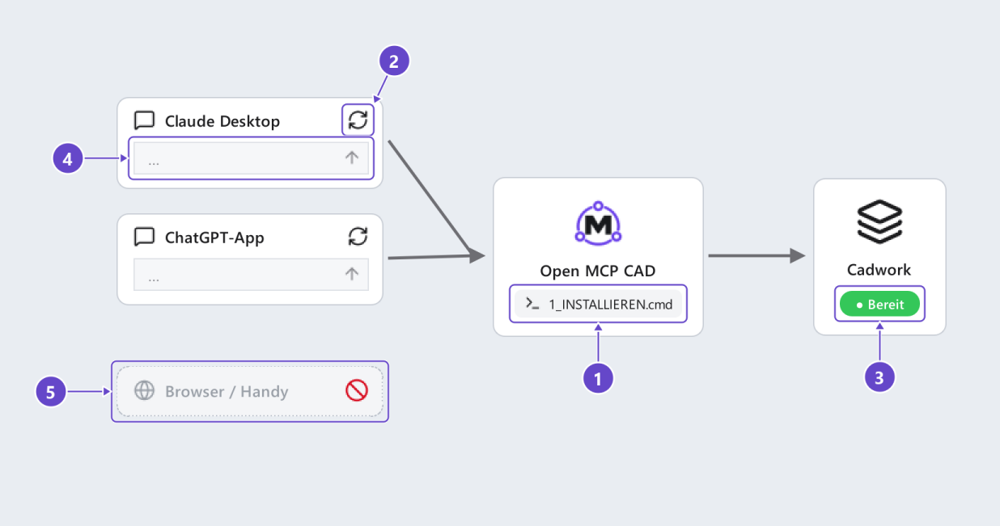

1. Das Einrichtungsfenster hat Open MCP CAD in der App eingetragen. Hast
   du die App erst danach installiert: 1_INSTALLIEREN.cmd nochmals
   doppelklicken.
2. Die App ganz beenden und neu starten. Erst dann kennt sie Open MCP
   CAD.
3. In Cadwork auf **Open MCP CAD** klicken, bis die Leiste **Bereit**
   zeigt.
4. Im Chat der App ganz normal schreiben, zum Beispiel den Testsatz aus
   Abschnitt 5. Fragt die App, ob sie Open MCP CAD benutzen darf:
   erlauben. Zum Prüfen kannst du fragen: «Welche Datei ist in Cadwork
   offen?» Nennt die KI deine Datei, ist alles verbunden. Sonst hilft
   Abschnitt 8.
5. Im Browser oder am Handy geht es nicht, nur mit der App am PC.

### Chat direkt in Cadwork

Wählst du «Direkt in Cadwork im Chat» oder «Beides», fragt das Fenster
nach der KI für den Chat:

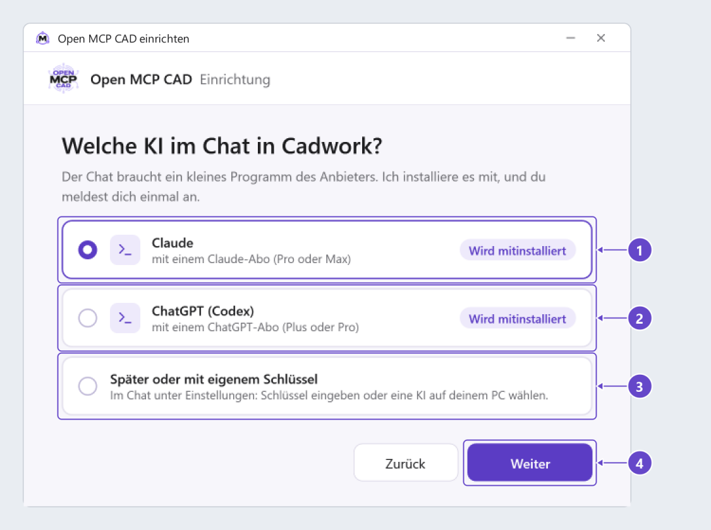

1. Claude, mit einem Claude-Abo. Das Fenster installiert dafür Claude
   Code mit dem offiziellen Befehl von Anthropic.
2. ChatGPT, mit einem ChatGPT-Abo. Das Fenster installiert dafür Codex
   mit dem offiziellen Befehl von OpenAI. Die ChatGPT-App allein genügt
   für den Chat in Cadwork nicht.
3. Später oder mit eigenem Schlüssel (siehe unten).
4. **Weiter**.

Nach dem Installieren meldest du dich einmal an:

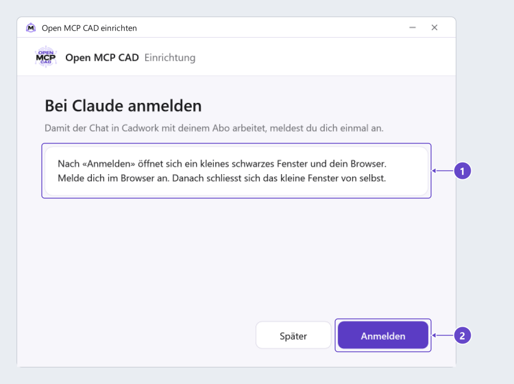

1. So geht es: ein kleines schwarzes Fenster und dein Browser öffnen
   sich. Im Browser mit deinem Konto anmelden.
2. **Anmelden** klicken. Danach steht «Fertig eingerichtet». **Später**
   geht auch; dann 1_INSTALLIEREN.cmd später nochmals starten.

Danach in Cadwork auf **Open MCP CAD** klicken, in der Leiste auf die
Sprechblase klicken und im Chat schreiben.

### Für Fortgeschrittene

Ist im Chat in Cadwork noch keine KI eingerichtet (etwa nach «Später»),
steht dort diese Karte (die Sprechblase in der Leiste öffnet den Chat):

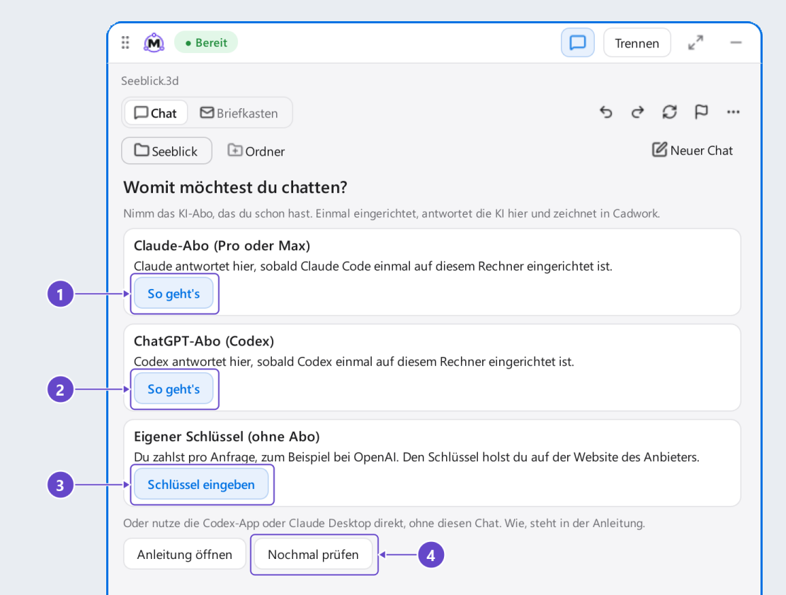

1. Mit einem Claude-Abo: **So geht's** zeigt den einen Schritt, der noch
   fehlt (dieselben Befehle wie in Weg A, Schritt 1).
2. Mit einem ChatGPT-Abo: **So geht's** zeigt die Befehle für Codex.
3. Ohne Abo: **Schlüssel eingeben** öffnet die Einstellungen beim Feld
   für den Schlüssel. Dort wählst du unter **Wer antwortet** auch eine
   lokale KI auf deinem PC, zum Beispiel Ollama: ohne Abo, aber gute
   Ergebnisse brauchen ein starkes Modell und einen starken PC.
4. Nach dem Einrichten **Nochmal prüfen**. Sobald ein Weg bereit ist,
   verschwindet die Karte, und du kannst schreiben.

## 7. So arbeitest du damit

So sieht Open MCP CAD in Cadwork aus. Die Nummern im Bild gehören zu den
Punkten darunter.

### Plugin starten

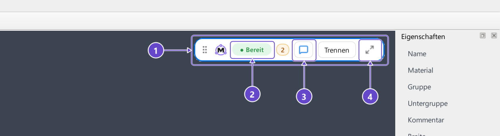

1. Im Plugin-Menü auf **Open MCP CAD** klicken. Oben rechts über der
   Zeichnung erscheint die Leiste.
2. **Bereit** heisst: Cadwork ist verbunden und die KI kann loslegen.
3. Die Sprechblase öffnet den Chat unter der Leiste.
4. Dieser Knopf dockt das Fenster rechts an, in einer eigenen Spalte.

### Mit der KI chatten

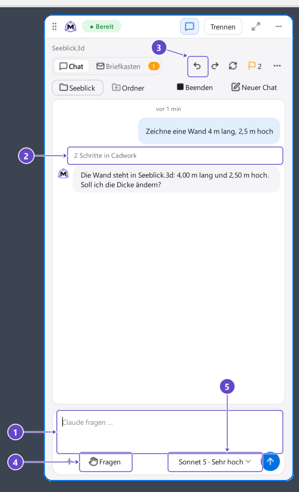

1. Hier schreibst du, was du brauchst, zum Beispiel den Testsatz aus
   Abschnitt 5.
2. Jeder Schritt in Cadwork steht im Verlauf. Ein Klick zeigt die
   Einzelheiten.
3. Der Pfeil nimmt den letzten Schritt in Cadwork zurück. Daneben:
   wiederherstellen und neu zeichnen.
4. Der Modus bestimmt, wie viel die KI allein darf: **Nur lesen**,
   **Fragen** (vor jeder Änderung), **Cadwork frei** oder **Alles
   automatisch**.
5. Hier wählst du Modell und Denkstufe.

### Rechts angedockt

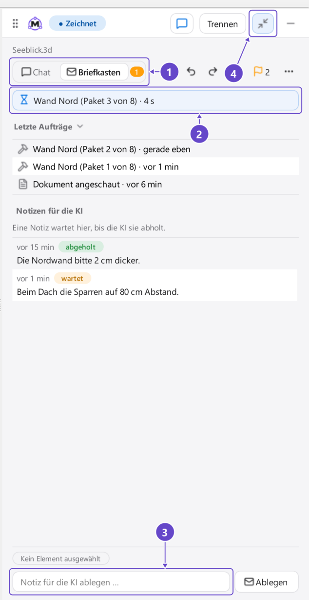

1. Wechselt zwischen **Chat** und **Briefkasten**.
2. Im Briefkasten steht, was gerade in Cadwork läuft. Darunter die
   letzten Aufträge.
3. Hier legst du eine Notiz für die KI ab. Sie wartet, bis die KI sie
   abholt.
4. Löst das Fenster wieder, es schwebt dann frei.

### Während die KI zeichnet

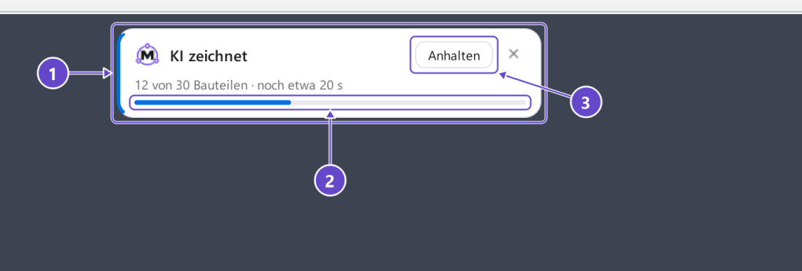

1. Eine kleine Anzeige über der Zeichnung zeigt, dass die KI arbeitet.
2. Wie viele Bauteile schon stehen und wie lange es noch dauert.
3. **Anhalten** verwirft die wartenden Aufträge. Der laufende Schritt
   wird noch fertig.

## 8. Wenn es nicht klappt

- **Der Klick auf Open MCP CAD tut nichts:** der Grund steht in der Datei
  `C:\Users\Public\OpenMcpCad_start.log`.
- **Die KI kennt Cadwork nicht:** das KI-Programm ganz schliessen und neu
  starten. Hilft das nicht, 1_INSTALLIEREN.cmd nochmals doppelklicken,
  die App angehakt lassen und **Installieren** klicken. Bei ChatGPT
  die ChatGPT-App aus dem Microsoft Store nehmen; die ältere
  «ChatGPT Classic» kennt Open MCP CAD nicht.
- **Die KI sagt, Cadwork sei nicht erreichbar:** in Cadwork auf **Open
  MCP CAD** klicken und warten, bis die Leiste **Bereit** zeigt.
- **Im Plugin-Chat steht «Womit möchtest du chatten?»:** dort den Weg
  wählen, der zu deinem Abo passt; die Knöpfe zeigen den nächsten Schritt.
- **Wenn du eine KI um Hilfe bittest** (etwa «installiere das»): gib
  ihr die Datei `Programmdateien\FUER_KI_ASSISTENTEN.md`. Darin steht,
  was sie tun soll. Will sie zuerst etwas dazubauen (etwa einen
  «Adapter»): nicht nötig, alles ist schon da.
- **Sonst:** schreib uns auf
  [github.com/sebastiankoukoui/open-mcp-cad/issues](https://github.com/sebastiankoukoui/open-mcp-cad/issues)
  oder über [lignoai.ch](https://lignoai.ch). Hänge die Dateien
  `C:\Users\Public\OpenMcpCad_start.log` und
  `C:\Users\Public\OpenMcpCad_installer.log` an (das Protokoll des
  Einrichtungsfensters).

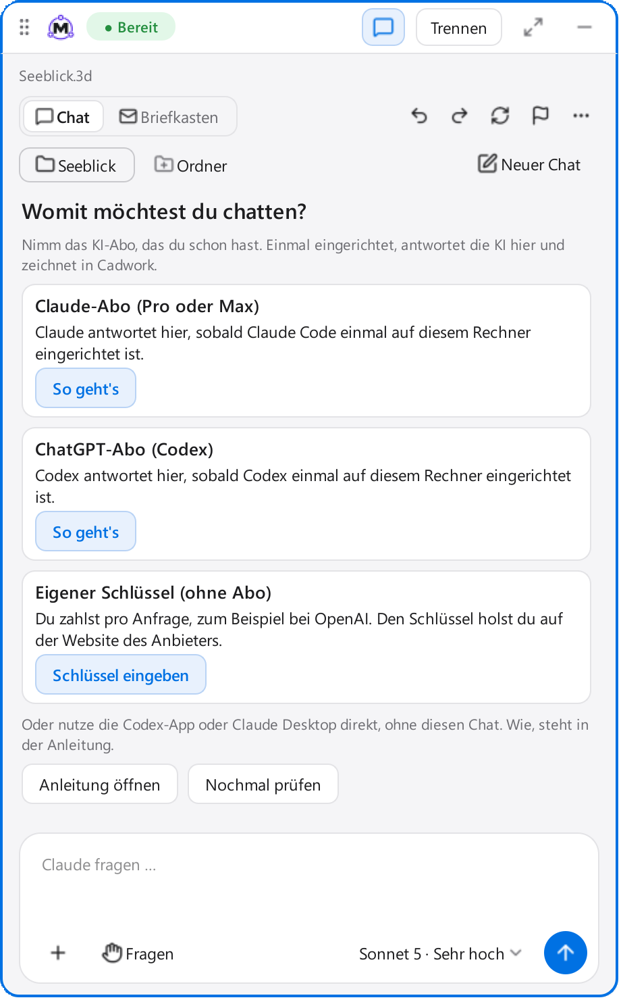

Mehr (alle Einstellungen, Deinstallation): die ausführliche Anleitung im
Ordner Programmdateien.
